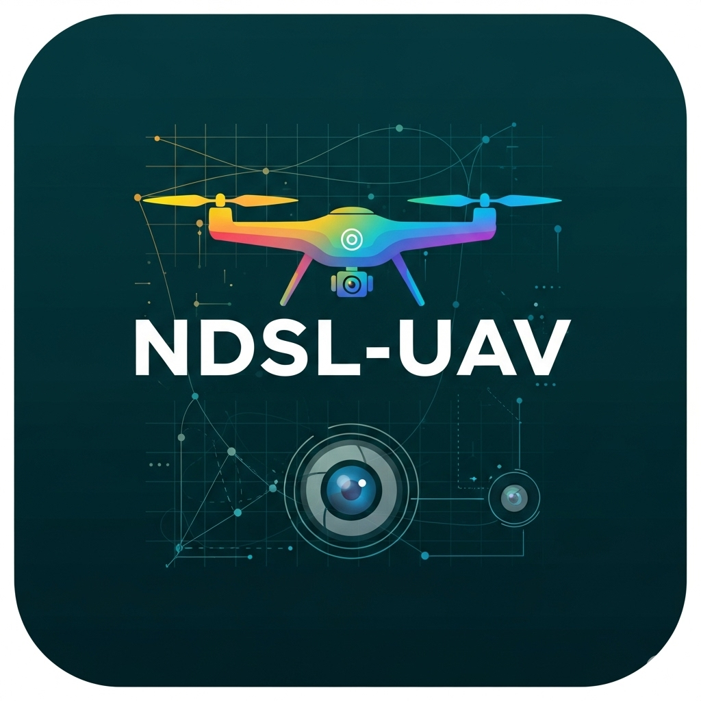

## This is ndsl-UAV 👋

---

- :sunglasses: From **UESTC NDSL Lab**, paying attention to **UAV and related fields**.

#### :computer: Projects:

- [Study plan: For beginner of UAV(private)](https://github.com/ndsl-UAV/study_plan)
- [Template-CMake-Project: A template for project with CMake (private)](https://github.com/ndsl-UAV/Template-CMake-Project)
- [Past UAV Study Notes](https://github.com/ndsl-UAV/past_study_notes)

##### :construction: Other Projects
